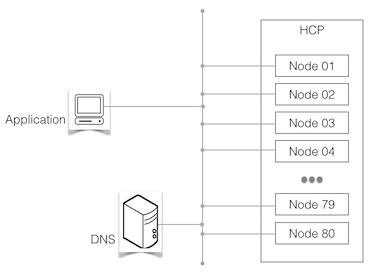

Preface
=======

Intention
---------

There are several needs that led to the creation of the HCP SDK:

    *   Blueprint implementation of a connector module to
        access HCPs authenticated :term:`namespaces <Namespace>` in a language that is easy
        enough to understand for any developers, whatever language she/he
        normally uses, to provide a base for own development.
    *   Showcase for coding guidelines outlined below.
    *   Demonstration material for developer trainings.
    *   And last, but not least, a replacement for the various modules
        the author used in the past for his own coding projects.

About HCP
---------

   A simple HCP environment

**Hitachi Content Platform (HCP)** is a distributed object storage system
designed to support large, growing repositories of fixed-content data. An
HCP system consists of both hardware (physical or virtual) and software.

HCP stores objects that include both data and metadata that describes
that data. HCP distributes these objects across the storage space. HCP
represents objects either as URLs or as files in a standard file system.
An HCP repository is partitioned into namespaces. Each
:term:`namespace <Namespace>` consists
of a distinct logical grouping of objects with its own directory structure.
:term:`Namespaces <Namespace>` are owned and managed by :term:`tenants <Tenant>`.

HCP provides access to objects through a variety of industry-standard
protocols, as well as through a native http[s]/:term:`reST` interface.

Focus
-----

**hcpsdk** primarily focuses on HCP version 3 and above, and the
:term:`authenticated Namespaces <Namespace>` invented with version 3.

For using **hcpsdk** with the :term:`Default Namespace <Default Namespace>`,
see :doc:`Appendix 1 <A0_appendixes/A1_apdx1_defns>`.

Using the **hcpsdk.mapi.replication** class needs functionality
invented with HCP version 7.

Coding for HCP
--------------

Even as HCP might behave like a web server at first glance, it has some
very different characteristics when it comes to coding against it, using
one of the http/:term:`reST` based interfaces (native http/:term:`reST`,
:term:`HS3` and :term:`HSwift`). This isn't really relevant for an application doing a
single request from time to time, but it is critical for an application
designated for high load / high performance HCP access.

To create an application optimized for optimal HCP access for the latter case:

    1)  Use threading or multiprocessing to access HCP using multiple
        connections in parallel

    2)  Use all available nodes, in conjunction with (1.)

    3)  Keep connections persistent, as connection setup is an expensive
        operation, especially when using https. Nevertheless, release connections
        if unused for some time, as one should not block an HCP connection slot
        permanently without using it.

    4)  If there's no urgent need for an human-readable structure, use a
        structure optimized for HCP, as demonstrated with the :doc:`35_pathbuilder`
        subpackage

There are some additional suggestions not aiming at performance,
but for reliability:

    5)  If there is no load balancer in the data path to HCP, cache HCPs
        IP addresses in the application and use them to access all nodes
        in a round-robin fashion. Refresh the cached address pool from time
        to time and on a failed Connection, too.
        *Depending on how HCP has been integrated with the corporate* :term:`DNS`\ *,
        this can lower network traffic overhead significantly.*

    6)  If there is a replication target HCP, make the application replica-aware -
        at least, allow the application to read from the replica.

    7)  As a last resort, make sure the application can survive some time of
        not being able to connect to HCP by caching content locally to a
        certain degree (this is not covered by this SDK).